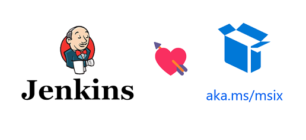

# Create a Jenkins pipeline to deploy Desktop Apps as MSIX

This repo is used by a series of posts to demonstrate how packaging Desktop applications to MSIX using Jenkins.

> Parts:
> 
> 1. **Setup the Jenkins environment**: install Jenkins and the required tools.
> 2. **Packaging a Visual Studio solution:** for applications that use Visual Studio IDE, like Windows Forms and WPF.
> 3. **Packaging a solution developed outside Visual Studio:** for applications developed outside VS, i.e., in others IDEs like Eclipse or **Visual Studio Code**, for **Java GUI** application.
> 4. **Packaging using the [VB6RegistryTool](https://github.com/luishdemetrio/Vb6VirtualRegistry):** despite of the name, the tool can be used by any technology.

## Disclaimer
I am not a Jenkins specialist, thus the idea here is to keep it simple and only demonstrate the basics to create a Jenkins Pipeline to package an application to MSIX. This post don't have the pretension to describe the best-practices to setup a Jenkins environment.

## Requirement

* Windows Server 2019
* [Jenkins](https://www.jenkins.io/)
* [OpenJDK](https://adoptium.net/?variant=openjdk11) or Java 8
* [Git for Windows](https://git-scm.com/downloads)
* [Visual Studio 2019 or newest](https://visualstudio.microsoft.com/vs/)
* [Maven](https://maven.apache.org/download.cgi) (used in the second scenario)